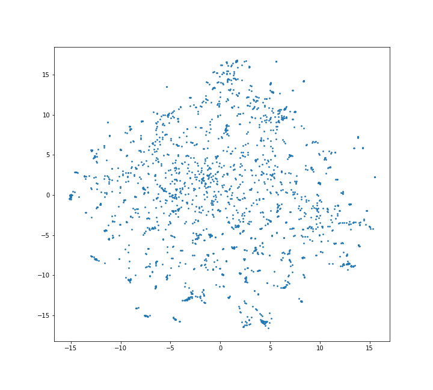

# NLP

#### Product Recommendations using Word Embeddings:
  Trained the word embeddings for the product codes using gensim Word2Vec model on an Online Retail dataset with 5,41,909 records of purchases made by various customers.
  
  The embeddings when plotted on a scatter plot looks as shown:
  
  
  From the above plot we can see product codes forming clusters and using vector similarities, we can identify similar products for a particular product.
  
#### Sentiment Analysis using Word2Vec & LSTM:
Achieved 94% accuracy after training on Amazon Reviews dataset with single LSTM layer & pretrained Word2Vec embeddings.
