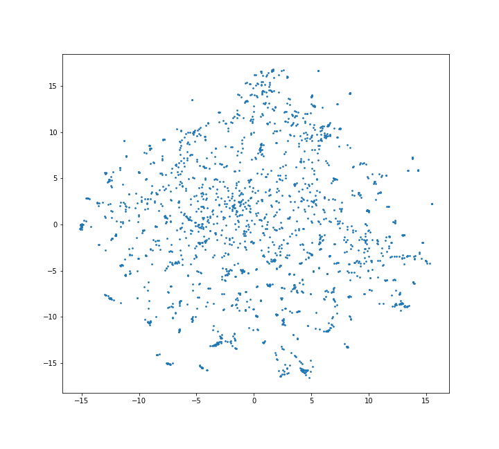

# NLP

#### Product Recommendation:
  Trained the word embeddings for the product codes using gensim Word2Vec model on an Online Retail dataset with 5,41,909 records of purchases made by various customers.
  
  The embeddings when plotted on a scatter plot looks as shown:
  
